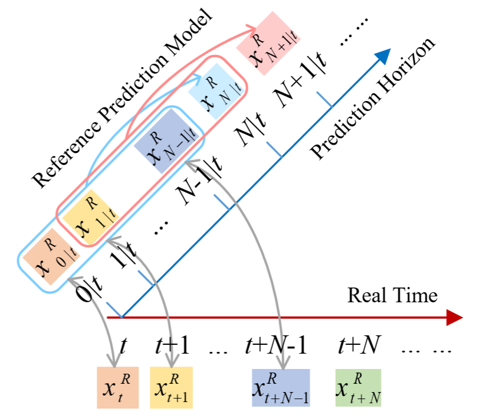
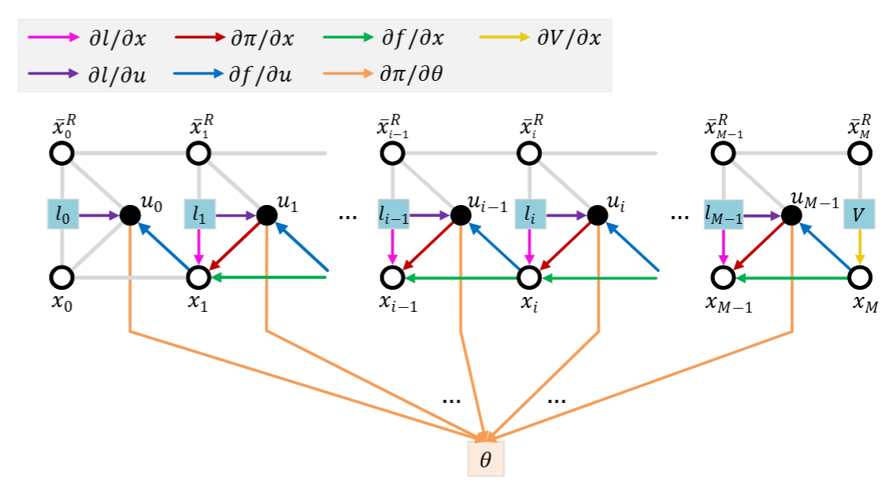

# FAADP for Accurate Vehicle Tracking

This repository accompanies the paper **“Foresight-Aware Reinforcement
Learning for Infinite-Horizon Optimal Tracking Control.”** FAADP augments the
vehicle state with an `N`-step preview of the reference trajectory. In the
code, this preview horizon is configured via `vehicleDynamicConfig.refNum`—
changing this value directly sets the `N` described in the paper and adjusts
the actor/critic input dimensionality as well as the MPC terminal-cost
features.

The implementation now lives under the `farl/` Python package, which exposes
the environment, networks, solver, training loop, and simulation utilities.
Minimal wrappers (`main.py`, `simulation.py`) stay at the repo root so that
`python main.py` or `python simulation.py` continue to work.

## Environment Setup

```bash
conda create -n farl python=3.9
conda activate farl
pip install -r requirements.txt  # or install torch, casadi, gym, matplotlib, pandas, tqdm
```

Key dependencies:

- `torch` for the actor/critic networks
- `casadi` + `l4casadi` for MPC baselines and terminal-value integration
- `gym`-style interface for the tracking environment (Gym ≤0.26 recommended)
- `matplotlib`, `pandas`, `tqdm` for analysis and logging

## Repository Layout

```
farl/                 # Core package (env, networks, solver, simulation, training, configs)
main.py               # Training entry-point (wraps farl.main)
simulation.py         # CLI wrapper for batched simulation/analysis
run_exp.sh            # Convenience script to sweep multiple ADP checkpoints
Results_dir/, Result_*# Example experiment folders produced by scripts
```

## Training a Policy

```bash
python main.py            # or: python -m farl.main
```

This script will:

1. Instantiate `farl.env.TrackingEnv` and build actor/critic networks.
2. Run the policy-evaluation/policy-improvement loop (`farl.training.Train`).
3. Log TensorBoard summaries under `Results_dir/refNum*/<timestamp>/train`.
4. Periodically evaluate the policy on sine/DLC/circle/random trajectories.

Adjust hyper-parameters in `farl/config.py`:

- `trainConfig`: learning rates, rollout depth, replay sizes, tangent-line mode.
- `vehicleDynamicConfig`: vehicle model, sampling time, and **preview horizon**
  `refNum = N`.
- `MPCConfig`: MPC prediction length(s) used in training diagnostics.

## Running Simulation Studies

After training, compare FAADP with finite-horizon MPC and MPC with terminal
value baselines:

```bash
python simulation.py \
  --adp_dir ./Results_dir/refNum9/<timestamp> \
  --one_step_value_dir ./Results_dir/refNum1/<legacy-critic> \
  --num_experiments 5
```

The simulation CLI automatically extracts `refNum` from `--adp_dir`, executes
multiple seeds, and stores CSV logs plus summary statistics under
`./Multiple_Experiments_refNum*/<timestamp>/`.

- `--one_step_value_dir` (optional) loads the 7-D critic trained with `N=1`,
  enabling the “MPC w/ 1-step terminal cost” baseline.
- The “multi-step” terminal cost baseline always uses the critic contained in
  `--adp_dir`, which matches the current `refNum = N`.

To sweep multiple checkpoints, edit `run_exp.sh` and execute:

```bash
bash run_exp.sh
```

Outputs include:

- `multiple_experiments_results.csv`: per-experiment metrics
- `experiments_summary_clean.csv`: aggregated mean/std/min/max per metric
- Figures under `Results_dir/.../simulationReal/<curve>/` for trajectory and error plots

## Plotting and Post-processing

Two optional CLI helpers (figure outputs are not tracked in the repo) simplify
visualization:

- `plot_learning_curves.py`: load TensorBoard event files and draw smoothed
  training curves grouped by preview horizon. Example:

  ```bash
  python plot_learning_curves.py \
    --tag "DLC cost" \
    --runs "N=1:Results_dir/refNum1/.../events.out.tfevents..." \
    --runs "N=9:Results_dir/refNum9/.../events.out.tfevents..." \
    --output figures/dlc_cost.png
  ```

- `plot_simulation_results.py`: plot CSV metrics exported by `farl.simulation`
  for any curve type (sine/DLC/etc.). Example:

  ```bash
  python plot_simulation_results.py \
    --sim-dir Results_dir/refNum9/<timestamp>/simulationReal/sine \
    --algorithm "FAADP:" \
    --algorithm "MPC-9 w/o TC:-MPC-9_wo_TC" \
    --algorithm "MPC-9 w/ 1-step TC:-MPC-9_w_1-step_TC" \
    --algorithm "MPC-9 w/ 9-step TC:-MPC-9_w_9-step_TC"
  ```

Both scripts expose additional flags (`--metrics`, `--y-limits`, etc.)—run
`python <script> --help` to see the available options.

## Customization Tips

- **Trajectory Library**: edit or extend `MultiRefDynamics` (`farl/env.py`) to
  evaluate additional reference paths or random seeds.
- **Reward / Dynamics**: tweak `TrackingEnv.calReward` and
  `vehicleDynamicConfig` to explore new objectives or plant parameters.
- **Preview Horizon & MPC**: set `vehicleDynamicConfig.refNum = N` to change
  foresight length; adjust `MPCConfig.MPCStep` to test other planning horizons.

Inline docstrings throughout `farl/` provide further implementation details.

## Method Overview

Two figures summarize the FAADP workflow:

1. **Tracking problem with reference prediction model**  
     
   Depicts how the multi-step reference predictor supplies future waypoints to
   the augmented system state used by FAADP.

2. **Computational graph of the actor loss**  
     
   Highlights the policy-evaluation/improvement loop and emphasizes that the
   policy gradient is independent of the reference predictor’s derivatives,
   enabling efficient training.
